# 运行步骤

```
npm i
npm run json-serve
npm run start
util/http.ts 需要换一下baseURL json-serve的网址要不然不能获取数据
例如baseURL: 'https://b1d263b416ce1d201d94c3ff6e71b43e.pty.oscollege.net',
```

更换baseURL如下：

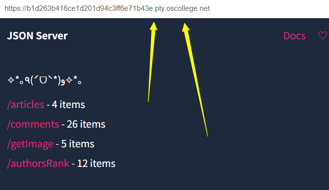

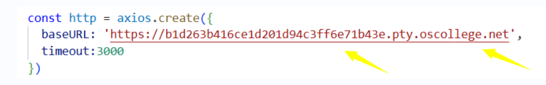

# 技术栈：React+TypeScript+Ant Design

# 整体结构

**layou**t作为应用的“骨架”，定义了所有页面共享的顶部导航栏和底部页脚。

中间的内容区域通过 <Outlet /> 来动态展示当前路由匹配到的页面组件（如首页、文章页等）。

**HomePage**聚合了多个功能性子组件。使用 Ant Design 的 Row 和 Col 进行响应式栅格布局，左侧是主内容区（轮播图和文章列表），右侧是侧边栏（排行榜等）。

**ImageCircle.tsx (轮播图)**: 负责展示横向的图片轮播。它通过 useRef 来巧妙地管理定时器，避免了因组件重渲染导致的内存泄漏或逻辑混乱问题。

**ArticleList.tsx (文章列表)**: 展示文章概览，并提供了“热门”和“最新”两种排序方式。它内部通过 useState 和 useEffect 管理文章数据和分页逻辑。

**ArticleRankList.tsx (排行榜)**: 实现了博主榜、评价榜等多个榜单的Tab切换。它创造性地使用了 Map 数据结构来管理不同 Tab 对应的数据获取函数和渲染模板，避免了冗长的 if-else 或 switch-case 语句，代码非常优雅。

**文章详情页 (/Article):**使用Store来进行数据管理

使用 React Router 提供的 useParams Hook 来从 URL 中动态获取文章 articleId。

通过 useAppDispatch 派发在 articleStore.ts 中定义的 getArticle 异步 Thunk，一次性获取文章详情和对应的评论列表。

用户的点赞、收藏等交互会派发相应的同步 action，直接在 Redux 中修改状态，UI 随之更新。

发布评论的流程是：用户提交 -> 派发 addComment Thunk -> Thunk 内部调用 API -> API 成功后，extraReducers 会捕获 fulfilled 状态，将新评论添加到 comments 数组中，UI 自动刷新。

## 结构图：

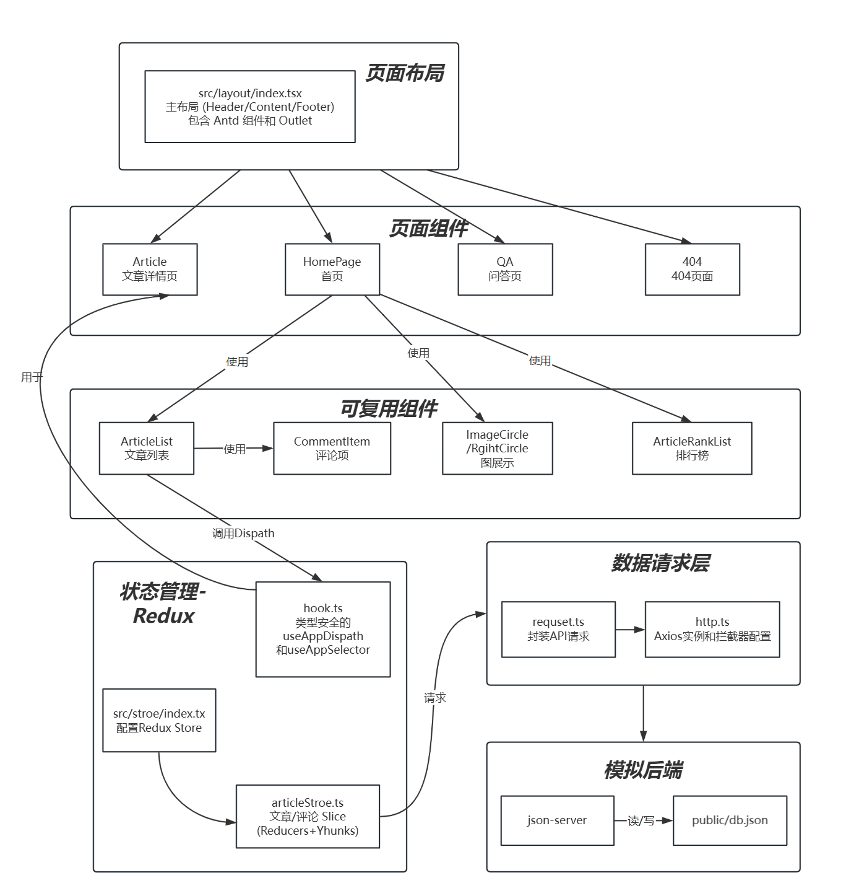

## 界面效果图：

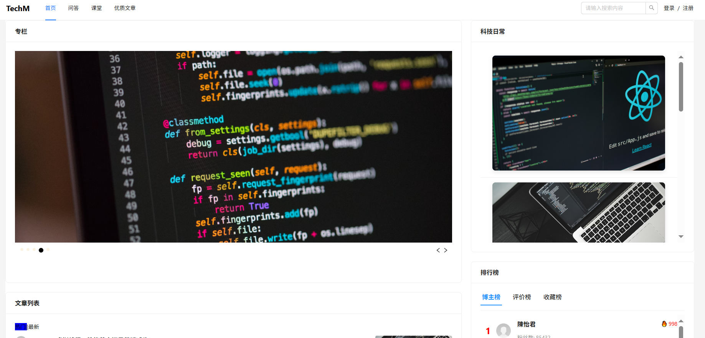

# 具体功能/组件设计

## ArticleStore设计

### 结构图如下：

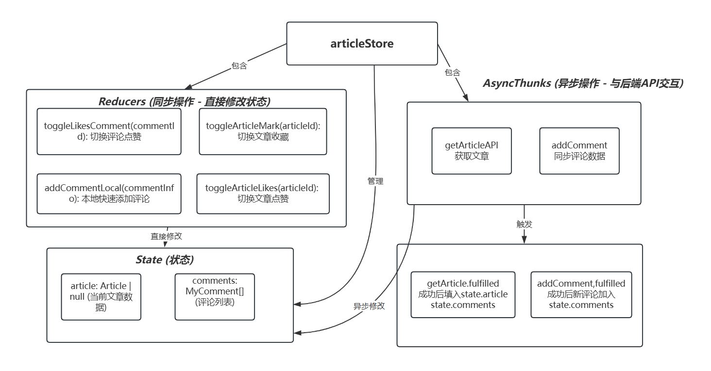

简单来说Stroe就是

1. State 管理数据

article: 当前正在查看的文章的详细信息（如标题、内容、作者等）。

comments: 这篇文章对应的所有评论列表。

2. Reducers (同步操作)

这些是能够立即、同步完成的状态修改任务。

toggleLikesComment:/toggleArticleMark/ toggleArticleLikes

3. AsyncThunks (异步操作) 

服务器进行通信的异步任务:getArticle:/addComment:

4. ExtraReducers - 

这个部分负责监听异步任务（AsyncThunks） 的执行结果，来更新State

反思和问题：

当时是想把评论也设计成一个Store，但是文章和评论联系有的紧密，文章里面有评论，文章自己可以管理自己的评论，虽然增加了耦合性但是逻辑上是通顺的。

其实最大的问题是 数据的异步更新 ，就是更新的时候导致了State的地址发生了变化，会强制更新，当时在做评论的添加的时候，先更新本地后更新云端，本地没有问题，云端更新就会刷新页面，很奇怪。

Reducer和AsyncThunks关键代码：

```tsx
toggleLikesComment: (state, action: PayloadAction<string>) => {

      const commentId = action.payload;

      const nowComment = findComment(state.comments!, commentId)

      if (nowComment) {
        nowComment.detailInfo.ifLike = !nowComment.detailInfo.ifLike;
        nowComment.detailInfo.likeNum += (nowComment.detailInfo.ifLike ? 1 : -1)
      }
    },
 addCommentLocal: (state, action: PayloadAction<{ author: Author, content: string }>) => {
 const newComment: MyComment = {
        id: `${Date.now()}`, // 调用 Date.now() 获取当前时间戳
        articleId: state.article!.id,
        content: action.payload.content,
        author: action.payload.author,
        detailInfo: {
          ifLike: false,
          likeNum: 0,
          commentNum: 0,
          // 修正: 调用 Date.now() 来获取当前时间的毫秒数
          publicDate: `${Date.now()}`
        },
        reply: []
      };
      state.comments.push(newComment);

    }
export const addComment = createAsyncThunk('comments/addComment',
  async (commentInfo: { author: Author, content: string, articleId: string }, { rejectWithValue }) => {
    try {
      const newComment: MyComment = {
        id: `${Date.now()}`, 
        articleId: commentInfo.articleId,
        content: commentInfo.content,
        author: commentInfo.author,
        detailInfo: {
          ifLike: false,
          likeNum: 0,
          commentNum: 0,
          publicDate: `${Date.now()}`
        },
        reply: []
      };
      const res = await addCommentAPI(newComment);
      return newComment;
    } catch (error: any) {
      console.error("添加评论失败:", error);
      return rejectWithValue(error.response?.data || '添加评论时发生未知错误');
    }
  }
)
```


## HomePage首页的设计

左侧由ArticleList.ts和ImageCircle右侧由 ArticleRankList.tsx, RightImageList.tsx四部分构成，构成图如下：

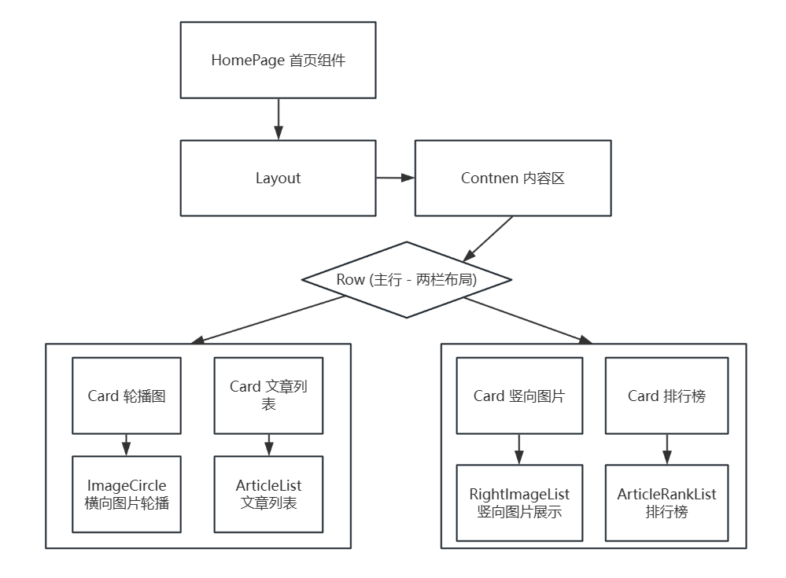

模糊搜索和防抖，就是使用了Antd的AutoComplete来实现一模糊搜索，使用setTimeout实现防抖关键代码如下：

```tsx
 <AutoComplete
  options={options}
  onSearch={debounceHandleSearchSuggestions}
  value={searchInfo}   onChange={setSearchInfo} >
  <Search placeholder='请输入搜索内容' style={{ width: 200 }} onSearch={debounce(handleSearch, 500)}
  value={searchInfo}
  onChange={(e) => setSearchInfo(e.target.value)}
/>
 </AutoComplete>
 const debounce = (fn: Function, t: number) => {
    let t_id: any = null;
    return function (...args: any[]) {//这个参数传递是有必要的！
      if (t_id)
        clearInterval(t_id)
      t_id = setTimeout(() => { fn(...args) }, t);
    }
  }
```

效果图如下：

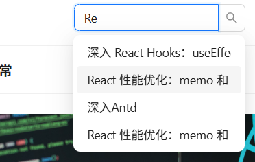

## ArticleList设计

结构图：

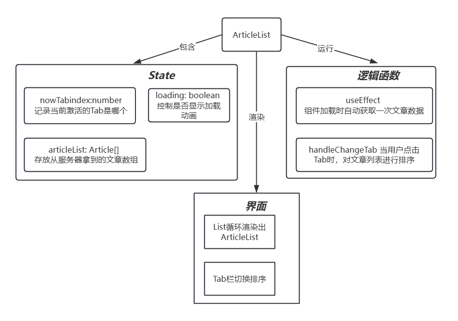

讲一下tab切换和排序的逻辑，其实就是判断 当前的key等不等于点击的，关键代码如下：

```
className={`${key === nowTabindex ? 'active' : ''}`}
```

通过三元运算符来判断是否添加类‘active’

 排序的逻辑，其实就是通过sort来添加排序规则再通过展开运算符‘…’来创建新数组，由于State的更新是看地址，所以浅拷贝可行,关键代码如下:

```
 return [...list].sort((a, b) => b.detailInfo.likeNum - a.detailInfo.likeNum)
```

来返回一个新数组。避免不能更新State。

效果图如下:

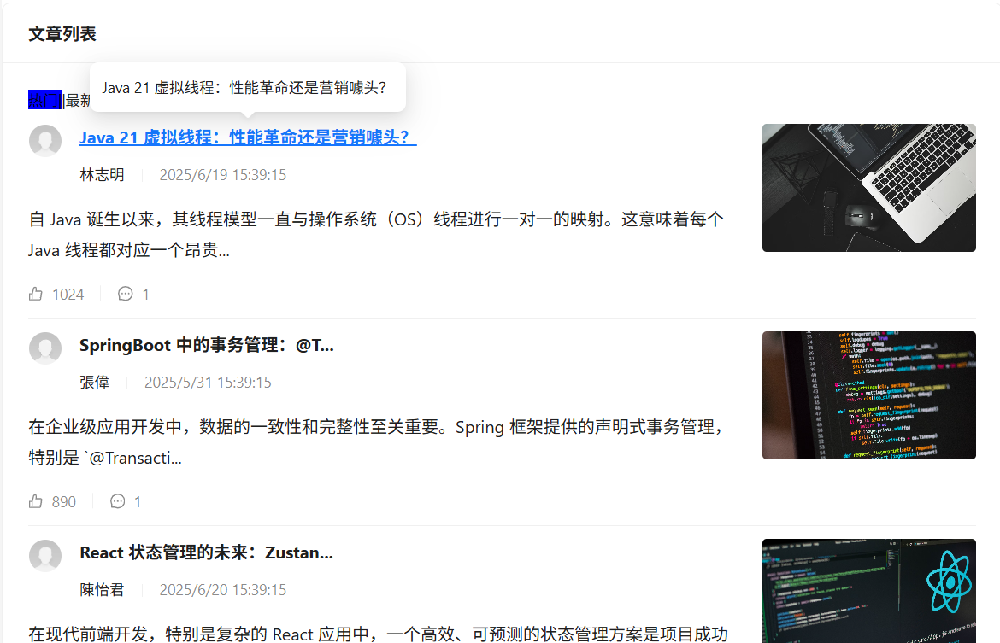

## ImageCircle轮播图结构

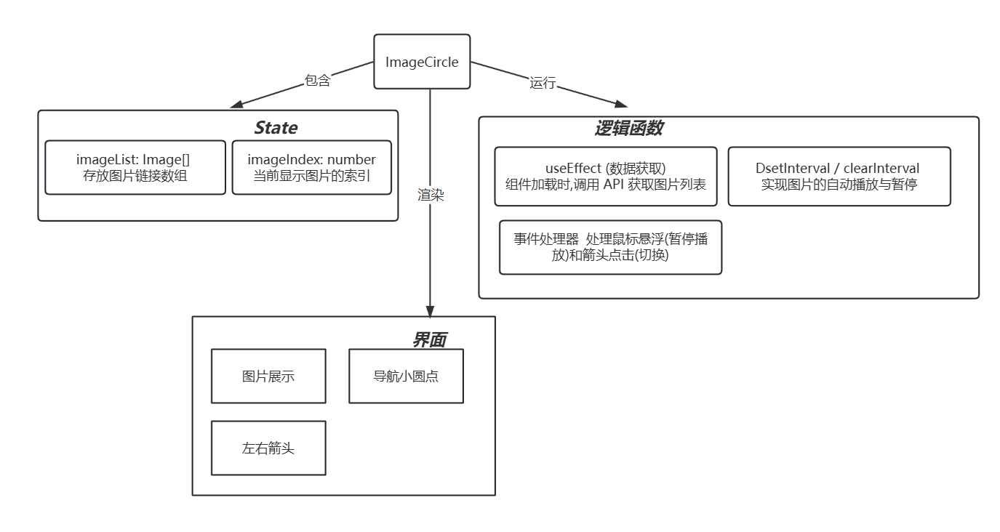

小圆点的状态转化和tab栏切换类似，这里重点解释轮播图的定时器循环播放

最开始为了避免更新多次创建定时器使用的是防抖，因为React在组件发生变化的时候会更新，会频繁触发定时器，会有很多的定时器，我发现不太行，还是会创建很多定时器，之后我想用全局变量来存储，但是全局变量只会有一个实例但是我的组件是可以复用的，会导致多个实例共享一个变量，会混乱，最后查询资料发现使用useRef来实现，定时器id的存储，不触发更新，持久性符合要求。关键代码如下:

```
const intervalIdRef = useRef<NodeJS.Timeout | null>(null);
  const beginImage = () => {
    if (intervalIdRef.current)
      clearInterval(intervalIdRef.current)
    intervalIdRef.current = setInterval(() => {
      setImageIndex(prevIndex => (prevIndex + 1) % imageList.length);
    }, 1000);
  }
  const stopImage = () => {
    if (intervalIdRef.current)
      clearInterval(intervalIdRef.current);
  }

```

效果图如下:

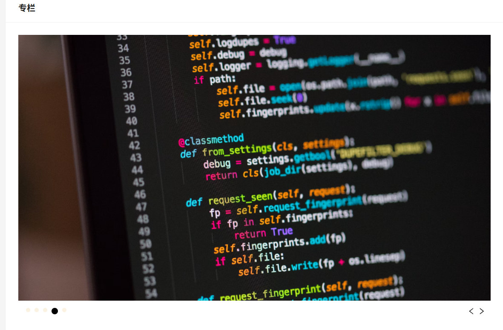

## RightImageList右侧图片列表

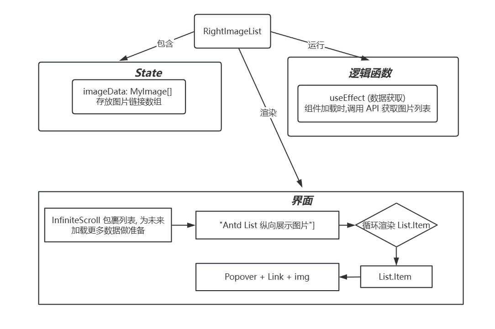

这个部分单纯的图片的展示，可能比较关键的是使用InfiniteScroll 包裹列表,来实现滚动效果，Link来实现点击，Popover来实现悬浮，这个页面没有出现大问题。

效果图如下:

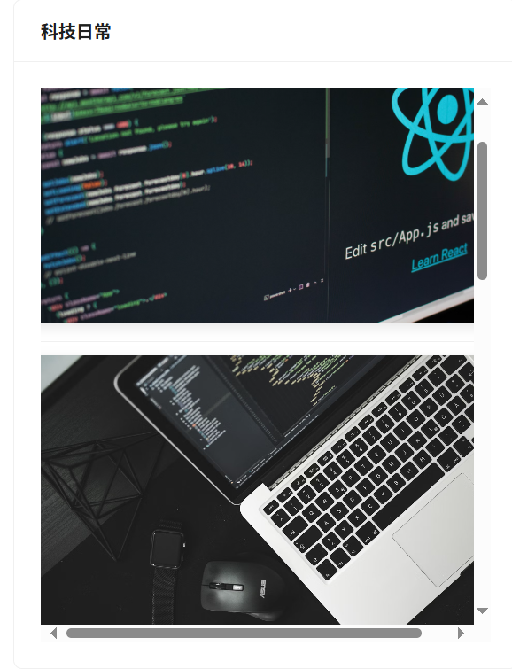

## ArticleRankList结构

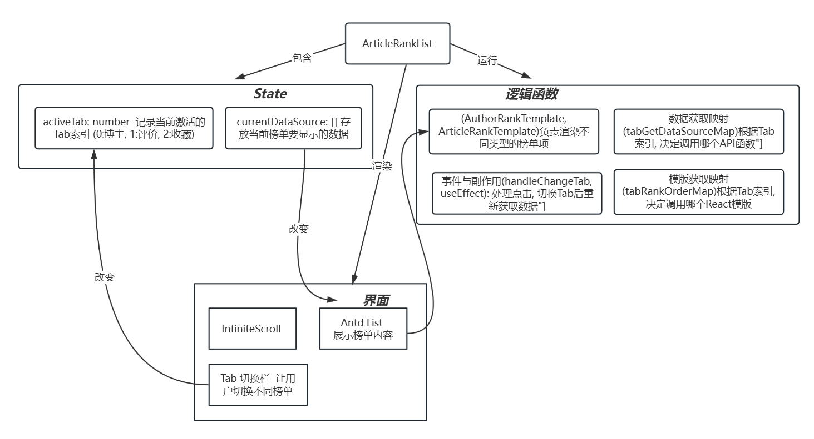

由两个组件一个tab栏控制组成，一个是博主的组件const AuthorRankTemplate: React.FC，另一个是文章的组件const ArticleRankTemplate，通过不同tab的key值然后改变dataSource来改变传入模版的Props来改变渲染内容。遇到的问题的，当activeTab发生改变的时候，渲染模版也发生了变化，导致数据源和模版不匹配，出现了undefined，所以当时试了挺久的，用useEffect，用同步，或是sleep，都不行，最后是设置为空就可以了，相当于‘空一拍’，让数据跟上。关键代码如下： 

```tsx
const handleChangeTab = (index: number) => {
    setActiveTab(index);
    setCurrentDataSource([]);//防止数据跟不上导致undefined中断程序运行导致数据获取不到}

```

还有个重要的就是使用Map来代替多重的if else if判断，一次成功的尝试，通过 activeTab,dateSourceà,Template三者有下标的映射关系，构建一个Map ，通过activeTab来改变两者，关键代码如下：

```tsx
const tabGetDataSourceMap = new Map<number, () => Promise<(Article | AuthorRank)[]>>([
    [0, getAuthorRankList],
    [1, getArticleRankByCommentList],
    [2, getArticleRankByMarkList]
  ]);
  }
}
}
const tabRankOrderMap = new Map<number, React.FC<renderProp>>(
[[0,AuthorRankTemplate],
[1,ArticleRankTemplate],
[2,ArticleRankTemplate]]);
  useEffect(() => {
    const getDataFun = async () => {
      const data = await tabGetDataSourceMap.get(activeTab)!();
      setCurrentDataSource(data);
    }
    getDataFun();
  }, [activeTab])

 renderItem={(item, index) => {
            return (tabRankOrderMap.get(activeTab)!({ item: item, index: index, orderKey: '' }))
}}
```

效果图如下：

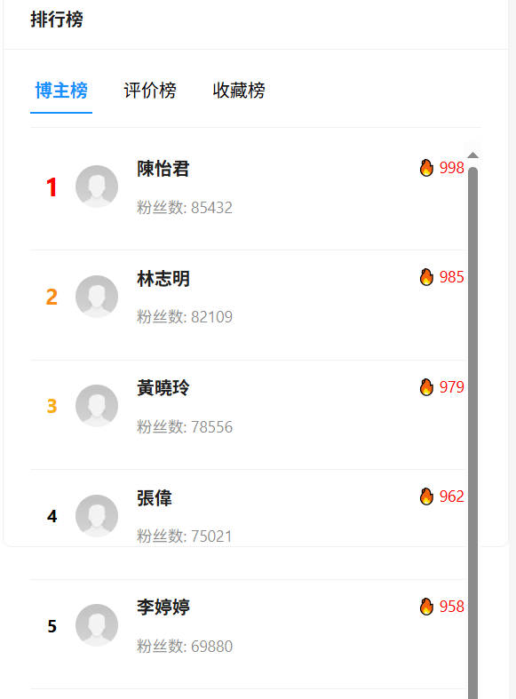

## Article文章详情页

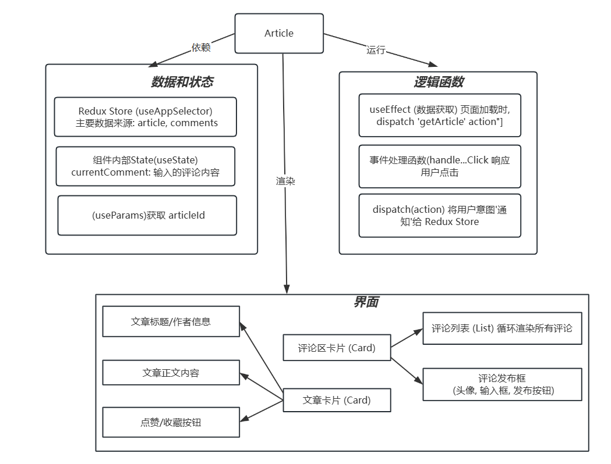

简单来说就两个部分，文章主体部分，有作者信息，文章内容，点赞收藏栏，还有评论区部分，发布评论，评论点赞。其中关键的是，更新评论，先进行本地更新，然后进行云端更新，云端更新完之后就会刷新。关键代码如下：

```tsx
await dispatch(addComment({author: author,
content: currentComment, articleId: article.id, 
      })).unwrap();
      setCurrentComment('');
     message.success('评论发布成功！');
 const handleToggleArticleLike = () => {
    if (articleId) dispatch(toggleArticleLikes(articleId));
  };
  const handleToggleArticleMark = () => {
    if (articleId) dispatch(toggleArticleMark(articleId));
  };
  const handleToggleLikeComment = (commentId: string) => {
    dispatch(toggleLikesComment(commentId));
  };
```

楼中楼回复，就是一个递归查询和递归渲染关键代码如下:

```tsx
递归查询
const findComment = (commentList: MyComment[], commentId: string): MyComment | null => {
  for (const comment of commentList) {
    if (comment.id === commentId)
      return comment;
    const replayComment = findComment(comment.reply, commentId)
    if (replayComment)
      return replayComment;
  }
  return null;
}
const findComment = (commentList: MyComment[], commentId: string): MyComment | null => {
  for (const comment of commentList) {
    if (comment.id === commentId)
      return comment;
    const replayComment = findComment(comment.reply, commentId)
    if (replayComment)
      return replayComment;
  }
  return null;
}
{递归渲染}
{reply && reply.length > 0 && (
          <div style={{ marginLeft: '20px', marginTop: '10px', borderLeft: '2px solid #f0f0f0', paddingLeft: '20px' }}>
            {reply.map(replyComment => (
              <CommentItem
                key={replyComment.id}
                comment={replyComment}
                toggleLike={toggleLike}
                articleId={articleId}
              />
            ))}

```

效果图如下:

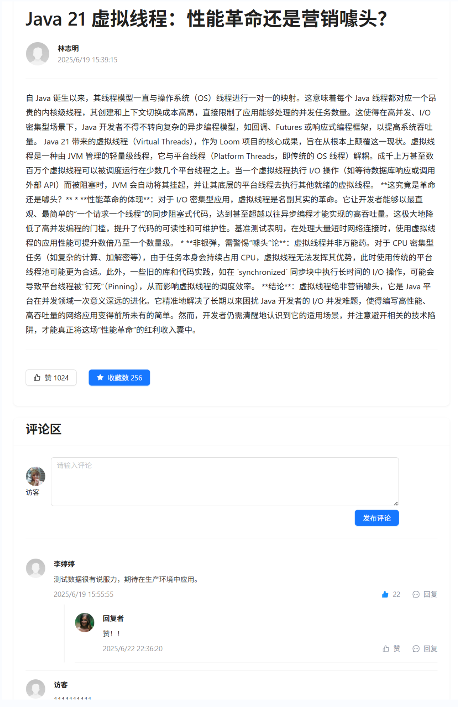